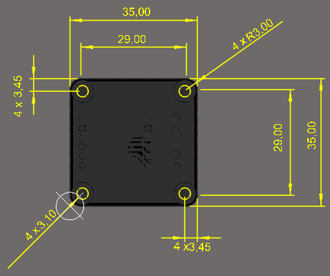
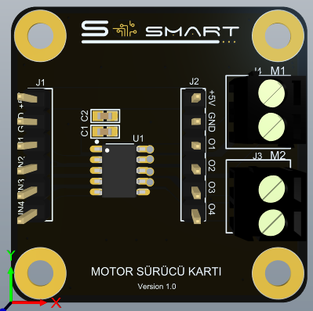
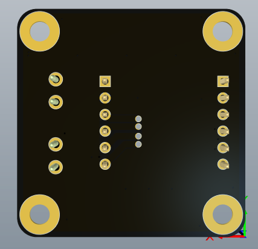
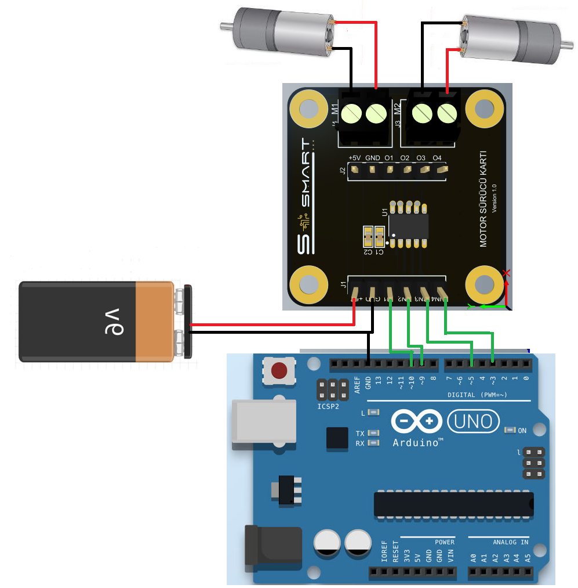
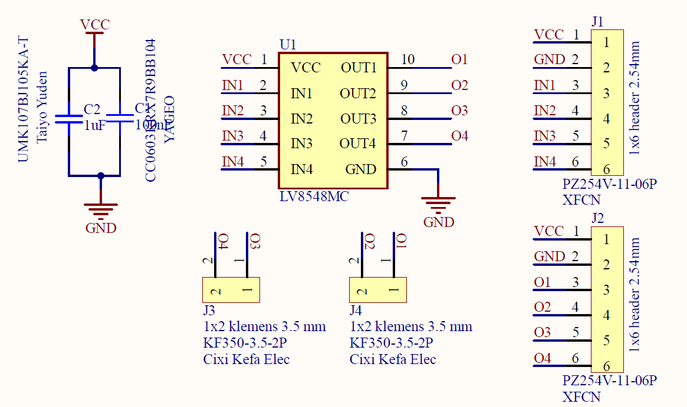

#  Motor Sürücü Kartı

## 1.KAPSAM
Bu döküman Motor Sürücü Kart'ının tanımını ve çalışma prensibini açıklar.

## 2. ÜRÜN PARAMETRELERİ
- 1 Çalışma Gerilimi: DC +4V ~ 16V 5A ~ 1.25A
- 2 Çalışma Sıcaklığı: -30~+85 °C 
- 3 Çalıştırabileceği Motor Sayısı: DC 2 Adet Step 1 Adet
## 3. MEKANİK



Pdf [MotorDrive](Circuit/MotorDrive.pdf)

## 4 . PİN AÇIKLAMALARI
J1 için: 2 adet DC motor sürmek için kullanılan giriş pimleridir.
|Pin Adı|Açıklama|
|------|------|
|+5V|DC +5V besleme girişi|
|GND|Toprak bağlantı pimi|
|IN1|Motor sürücü kontrol giriş pimi.PWM girebilir. IN2 ile birlikte kullanılır.|
|IN2|Motor sürücü kontrol giriş pimi.PWM girebilir.IN1 ile birlikte kullanılır.|
|IN3|Motor sürücü kontrol giriş pimi.PWM girebilir.IN4 ile birlikte kullanılır.|
|IN4|Motor sürücü kontrol giriş pimi.PWM girebilir.IN3 ile birlikte kullanılır.|

J2 için: 1 adet Step motor sürmek için kullanılan çıkış pimleridir.
|Pin Adı| Açıklama|
|------|------|
|+5V | DC +5V besleme girişi|
|GND|Toprak bağlantı pimi|
|O1|Motor sürücü çıkış pimidir.Motor bobini O2 terminali arasına bağlanır.|
|O2|Motor sürücü çıkış pimidir.Motor bobini O1 terminali arasına bağlanır.|
|O3|Motor sürücü çıkış pimidir.Motor bobini O4 terminali arasına bağlanır.|
|O4|Motor sürücü çıkış pimidir.Motor bobini O3 terminali arasına bağlanır.|
- J3 DC motor çıkış pimleri O3 ve O4'ü içerir. 
- J4 DC motor çıkış pimleri O1 ve O2'yi içerir.
### - NOT: Arduino ve benzeri ürünler ile birlikte kullanımda geliştirme kartları üzerinden besleme yapılmamalıdır.!!! Örnek olarak 5. Arduino Bağlantısına bakılabilir.

### 5. Arduino Bağlantısı


### 6. Devre

Data Sheet [LV8548MC](Circuit/LV8548MC.pdf)
Sch File [MotorDriver](Circuit/Motor_Driver.pdf) 
Bom List [BomList](Circuit/Motor_Driver_1.6_Black.zip) 
Gerber File [Gerber](Circuit/Motor_Driver.pdf) 

## GENEL BAKIŞ 
DC Motor Sürücü Kartı 2 adet DC motor 1 Adet Step motor sürmek için tasarlanmıştır. Aynı anda hem DC hem Step motor sürülmesi önerilmez.Prototiplemeye imkan sağlaması, arduino ve çeşitli devrelerde rahatça kullanılabilmesi için gerekli pinler devre kartı sayesinde dışarıya alınmıştır.Standart pin yapısı sayesinde rahatça kontrol edilebilir. Jumper kablolar ile bağlantıları yapılabilir. Sürücü IC olarak LV8548MC Motor Driver kullanılmıştır.Detaylı bilgi için linkler incelenebilir.
### Arduino Örnek Kodu
```
 int H=9;
 int L=10;

void setup ()
{

   pinMode(L,OUTPUT);
   pinMode(H,OUTPUT);
 
  }
void loop(){ 
  
  for(int L=0; L<255; L++){
   digitalWrite(10,L);
    delay(2);}
  for(int H=0; H<255; H++){
    digitalWrite(9,H);
    delay(2);}
   delay(100);
  for(int L=255; L>=0; L--) {
    digitalWrite(10,L);
    delay(2);}
  for(int H=255; H>=0; H--){
    digitalWrite(9,H);
    delay(2);}
    delay(1000);

}


```
[Motor_surucu](ArduionoExample/Motor_surucu/Motor_surucu.ino)
[Stepper Motor](ArduionoExample/step/step.ino)


